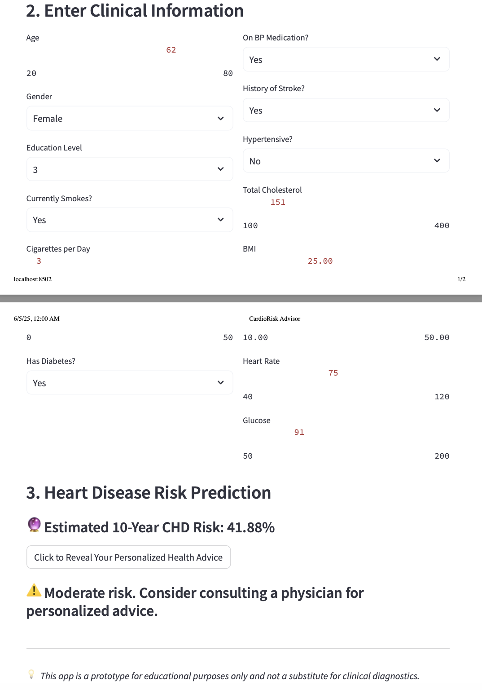

# CardioAdvisor.ai


CardioAdvisor.ai is a data-driven web application that predicts blood pressure from photoplethysmogram (PPG) signals and estimates 10-year cardiovascular disease risk using clinical data. It leverages machine learning models trained on biomedical datasets and provides an interactive interface built with Streamlit.

---

## 🚀 Features

- 📈 **Blood Pressure Prediction** from raw PPG signal using a trained CNN model
- ❤️ **Cardiovascular Risk Assessment** using clinical data based on the Framingham Risk Score
- 🧪 Real-time or batch input via CSV
- 📊 Clean, interactive web interface for visualization and insights
- ✅ Lightweight, local deployment with no external dependencies

---

## 🖼 Demo Screenshots

### 📌 Demo 1: Upload PPG Signal and Basic Info and Blood Pressure Prediction


### 📌 Demo 2: Heart Disease Risk Prediction Results Display



---

## 📂 Dataset

Kaggle

---

## 🧠 Model Overview

- **CNN Blood Pressure Estimator**: Trained on preprocessed PPG signal data to regress SBP/DBP
- **Risk Classifier**: Trained using Framingham study attributes such as age, sex, smoking, diabetes, cholesterol, etc.

---

## 🛠 Project Structure

```
CardioAdvisor/
├── CardioChat.ai_app.py         # Streamlit app
├── CardioRiskAdvisor.ipynb      # Risk model logic
├── Blood Pressure Estimation.ipynb # BP model logic
├── predicted_bp_from_ppg.csv    # Sample model output
├── Dataset/                     # Optional sample data
├── demo1.png                    # UI screenshot 1
├── demo2.png                    # UI screenshot 2
├── requirements.txt             # Python dependencies
└── README.md                    # This file
```

---

## ▶️ Installation & Usage

```bash
# Run the app
streamlit run CardioChat.ai_app.py
```

---

## 📜 License

MIT License

---

## ✉️ Contact

For questions please contact [myt@uchicago.edu](mailto:myt@uchicago.edu)
